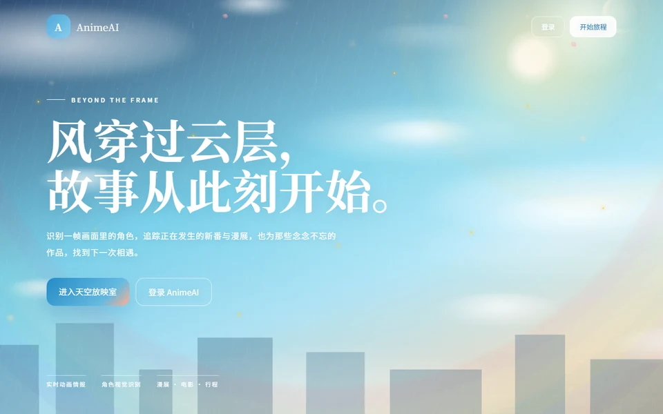

# 🎌 Anime AI · 动漫智能助手平台

> **截图识番 · 角色识别 · 番剧搜索 · AI 对话 · RAG 知识库 · TTS/ASR**
> Screenshot-to-anime recognition · Character ID · Anime search · AI chat · RAG · TTS/ASR

[](https://www.oracle.com/java/)
[](https://spring.io/projects/spring-boot)
[](https://spring.io/projects/spring-ai)
[](#rag-知识库)
[](https://onnxruntime.ai/)
[](#多模态)
[](https://redis.io/)
[](LICENSE)

A full-featured **AI assistant platform built around anime**: upload a screenshot, let AI tell you which anime it's from, which episode, and which character is in it. Also includes anime search & recommendation, airing reminders, pet/plant care with AI, weather, maps, image generation and voice (TTS/ASR).

一个以**动漫为核心**的 AI 智能助手平台：截图识番、角色识别、番剧搜索推荐、追番提醒，并集成天气、地图、宠物护理、图片生成、语音等多模态 AI 能力。

<p align="center">
  
</p>

---

## ✨ Features / 核心功能

### 🎬 Anime AI (Core) / 动漫 AI（平台核心）

| Feature | Description |
|---------|-------------|
| **截图识番** Screenshot recognition | `trace.moe` real-time matching (similarity ≥ 82%) + AniList GraphQL lookup + multi-level fallback: visible title → local character index → recent anime catalog → current season → cross-era candidate comparison |
| **角色识别** Character ID | Compares hairstyle, eye color, outfit features → character name, anime, confidence |
| **番剧服务** Anime services | Search, by-ID query, seasonal/quarterly, upcoming, TOP list, character search, anime news |
| **追番提醒** Airing alerts | Scheduled tasks + DB persistence for new anime/movie releases |

### 🐾 AI 看护 Pet / Plant Care
- PetProfile & PlantProfile management, CareRecord, CareReminder
- Medical triage, pet food safety check, plant safety check, nearby pet hospitals (Amap)
- AI care workflow (`SpringAiCareWorkflowService`)

### 🤖 通用 AI General AI
- Streaming chat via Spring AI with tool calling (`/api/ai/chat-with-tools`)
- Agent toolchain: image analysis / image editing / AI drawing / file parsing / web search / TTS
- Weather tool, Amap nearby search
- **Chat memory**: Redis + DB dual-layer, RAG Q&A via SQLite VectorStore
- Multi-turn sessions with `UserSession` + async message events

### 🎙️ 多模态 Multimodal
- **TTS**: Xunfei speech synthesis (`XfTtsService`)
- **ASR**: Alibaba DashScope (`DashScopeAsrService`)
- **Vision**: ONNX Runtime (CUDA) (`VisionService`)
- **Image generation**: `ImageGenerationService`

### 📦 其他 Extras
E-commerce module (products/categories), WeChat ilink SDK messaging, sensitive-word filtering.

## 🛠️ Tech Stack / 技术栈

```text
Backend     Java 21 · Spring Boot 3.5 · Spring AI (spring-ai-bom) · WebFlux
Frontend    Thymeleaf
Data        H2 · SQLite (VectorStore RAG) · Redis (chat memory) · MySQL (reserved)
AI Vision   ONNX Runtime (CUDA) · trace.moe API · AniList GraphQL
AI Voice    Xunfei TTS · DashScope ASR
External    Amap · weather API · AniList GraphQL · trace.moe
Others      Fastjson2 · OkHttp3 · HttpClient5 · Lombok
```

## 📐 Project Structure / 项目结构

```text
anime-ai
├── pom.xml
├── src/main/java/com/example/demo
│   ├── anime/          # 截图识番、角色识别、番剧服务（核心）
│   ├── ai/             # AI 对话、工具调用、动漫事件服务
│   ├── agent/          # Agent 工具链（图片/文件/搜索/TTS）
│   ├── aicare/         # 宠物/植物护理入口
│   ├── care/           # 护理服务（分诊、安全、提醒、附近医院）
│   ├── chat/           # 聊天记忆、会话、RAG 向量库
│   ├── vision/         # ONNX 视觉推理
│   ├── asr/ · tts/     # 语音识别 / 语音合成
│   ├── imagegen/       # AI 画图
│   ├── movie/          # 追番/电影提醒
│   ├── weather/        # 天气查询
│   ├── service/        # 高德地图
│   └── web/            # 页面控制器
├── tools/                  # 本地工具脚本
└── rag_knowledge.sqlite    # RAG 知识库
```

## ▶️ Quick Start / 快速开始

### 1. 配置环境变量 Environment variables

Create the following env vars (or edit `src/main/resources/application.properties`):

| Variable | Required | Description |
|----------|----------|-------------|
| `DEEPSEEK_API_KEY` | ✅ | DeepSeek (main chat / tool calling) |
| `DASHSCOPE_API_KEY` | ⚠️ | DashScope embedding / vision / ASR |
| `MYSQL_PASSWORD` | ⚠️ | MySQL password |
| `SENIVERSE_API_KEY` | ❌ | Weather API (心知天气) |
| `AMAP_API_KEY` | ❌ | Amap web services (nearby search) |
| `XUNFEI_APP_ID` / `XUNFEI_API_KEY` / `XUNFEI_API_SECRET` | ❌ | Xunfei TTS |

### 2. 运行 Run

```powershell
mvn spring-boot:run
# → http://localhost:8094
```

### 3. 可选：本地视觉模型 Optional: local vision model

Copy `vision_model.onnx` into `data/` for offline ONNX inference (model file not included due to size; use any ONNX-compatible vision model).

## 📝 Notes / 说明

- All external API keys are read from **environment variables** — never hardcode secrets.
- `data/`: DB files & vision models (large files not committed).
- Demo screenshots and the `tools/` folder contain helper scripts for local development.

## 📄 License

[MIT](LICENSE) © 2026 [sekai-lyr](https://github.com/sekai-lyr)

---

**⭐ If this project helped you, star it! 如果这个项目对你有帮助，欢迎 Star！**
